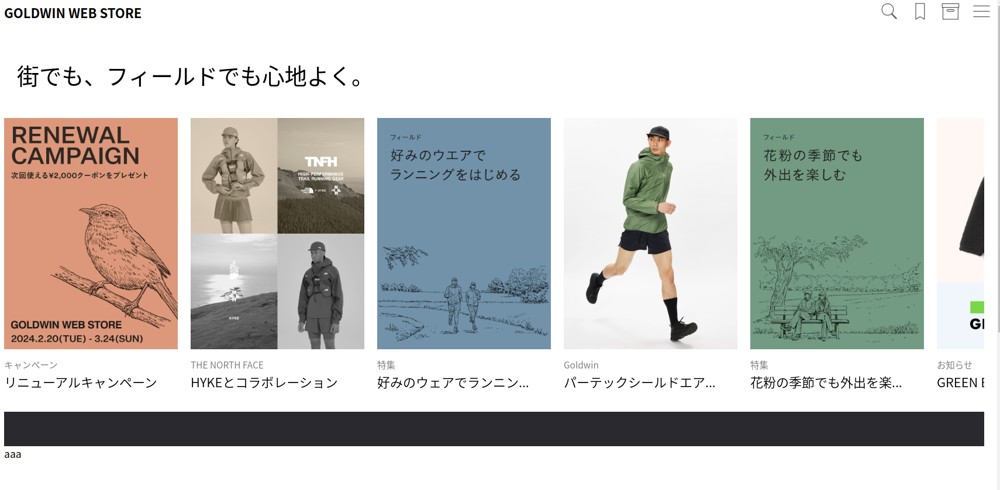
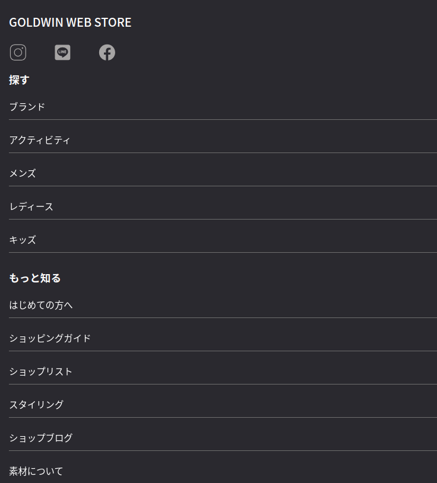

# Web模倣
## 現在のページ

モバイル版フッター

## 参考文献、参考資料、素材元
- svgアイコン　https://icons8.com/icons
- 参考サイト
GOLDWIN WEB STORE
URL: https://www.goldwin.co.jp/store/

## 構成
シンプルで見やすいECサイト。スタイリッシュで参考になると感じている。

# 2/25 
## ヘッダーと文字のアニメーションを再現
- フォント違いや仕様に一部ズレはあるものの、表現が形となっているので概ね満足。

# 2/26 
## フッターを再現。
- SNSアイコンを実装
- リンクをホバーした際のアニメーションを実装
 - 文字をホバーした際に下線が左からニョキっと生えてくる。

## 課題点
- コンポーネント化していないので、再実装が面倒。アニメーションは確実に役に立つのでコンポーネント化したいところ。

# 2/29
- スライダーの追加
- マーキーの追加途中
- ヘッダーのアイコンを追加
- フッターのモバイル版を追加

## 課題点
- スライダーのモバイル化
- ハンバーガーメニュークリック時のサブメニューの実装
- スライダーのホバーアニメーション